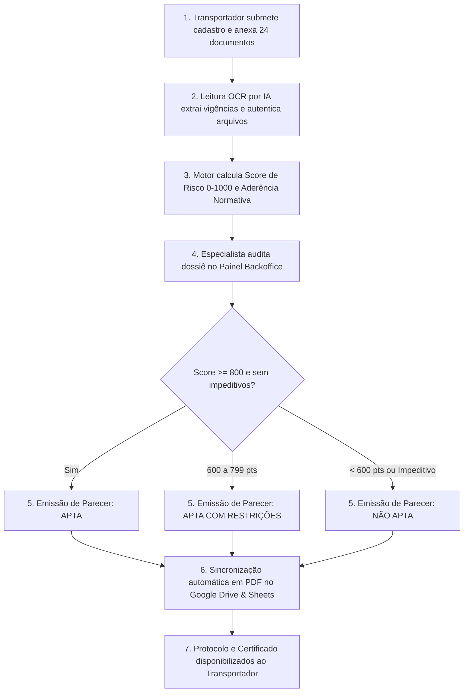

# PROCEDIMENTO OPERACIONAL PADRÃO (POP)

| **LOGSHARE LOGÍSTICA COLABORATIVA** | **CÓDIGO:** POP-LOG-HOM-001 | **VERSÃO:** 2.0 |
| :--- | :--- | :--- |
| **TÍTULO:** QUALIFICAÇÃO, AUDITORIA E HOMOLOGAÇÃO DE TRANSPORTADORES RODOVIÁRIOS | **DATA DE EMISSÃO:** 27/08/2026 | **PRÓXIMA REVISÃO:** 27/08/2027 |
| **ÁREA RESPONSÁVEL:** Compliance, Gestão de Risco & Qualidade | **CLASSIFICAÇÃO:** Uso Interno e Externo (Auditável) | **PÁGINA:** 1 de 6 |

---

## 1. OBJETIVO

Estabelecer os critérios padronizados, regras de pontuação (Score de Risco 0 a 1000) e fluxo de auditoria técnica para homologação, qualificação e monitoramento contínuo de Transportadores Rodoviários de Cargas na plataforma LogShare.

Este procedimento assegura a total aderência aos requisitos regulatórios, contratuais e de clientes corporativos de alto rigor, cobrindo especificamente:
- **ANVISA RDC Nº 48/2013 (Item 3.3.5)**: Boas Práticas de Fabricação, Armazenamento e Transporte de Produtos Cosméticos e Saneantes.
- **ISO 9001:2015 (Item 8.4.3)**: Informação e Controle de Provedores Externos de Serviços e Avaliação de Desempenho.
- **ISO 22716:2007 (Item 6.2)**: Contratos, Terceirização e Diretrizes de Boas Práticas de Fabricação Cosmética (GMP).
- **EFfCI GMP (Item 8.4.3)**: Boas Práticas para Fabricação e Transporte de Ingredientes Cosméticos.
- **Requisitos Corporativos de Excelência**: Critérios de Qualidade, Abastecimento, SSOMA (Saúde e Segurança Ocupacional), Meio Ambiente e Responsabilidade Social / Governança (ESG).

---

## 2. CAMPO DE APLICAÇÃO

Aplica-se a 100% dos transportadores rodoviários de cargas (empresas frotistas, cooperativas ou agregados com RNTRC ativo) cadastrados ou em processo de qualificação para prestar serviços de transporte na malha compartilhada LogShare.

---

## 3. DEFINIÇÕES E SIGLAS

- **AFE**: Autorização de Funcionamento de Empresa emitida pela ANVISA.
- **ANTT**: Agência Nacional de Transportes Terrestres.
- **CNDT**: Certidão Negativa de Débitos Trabalhistas (Tribunal Superior do Trabalho).
- **CRF**: Certificado de Regularidade do FGTS (Caixa Econômica Federal).
- **CRLV**: Certificado de Registro e Licenciamento de Veículo.
- **CRT**: Certificado de Responsabilidade Técnica (CRF/CRQ).
- **CTF/IBAMA**: Cadastro Técnico Federal de Atividades Potencialmente Poluidoras.
- **LMG**: Limite Máximo de Garantia da Apólice de Seguro.
- **PGR**: Plano de Gerenciamento de Risco.
- **RC-DC**: Responsabilidade Civil do Transportador Rodoviário por Desaparecimento de Carga.
- **RCTR-C**: Responsabilidade Civil do Transportador Rodoviário de Carga (Acidentes).
- **RNTRC**: Registro Nacional de Transportadores Rodoviários de Cargas.
- **SSOMA**: Segurança, Saúde Ocupacional e Meio Ambiente.

---

## 4. MATRIZ DE PONTUAÇÃO DO TRANSPORTADOR (SCORE DE RISCO: 0 A 1000 PONTOS)

O Score Global de Risco é calculado dinamicamente pelo motor algorítmico da plataforma, distribuído em 4 pilares:

```
SCORE GLOBAL (1000 pts) = Documental (300) + Financeiro (300) + Gestão de Risco (200) + Operacional (200)
```

### 4.1. Pilar 1: Regularidade Documental & Fiscal (0 a 300 pontos)

| Documento Auditado | ID no Sistema | Condição / Regra de Pontuação | Pontos |
| :--- | :--- | :--- | :---: |
| **Registro RNTRC / ANTT Ativo** | `doc_rntrc_antt` | Válido na base da ANTT e não vencido | **50 pts** |
| **Apólice RCTR-C ou Estipulação LogShare** | `doc_apolice_rctrc` | Apólice própria válida OU Operação sob Apólice Mestre LogShare | **40 pts** |
| **Apólice RC-DC ou Estipulação LogShare** | `doc_apolice_rcdc` | Apólice própria válida OU Operação sob Apólice Mestre LogShare | **40 pts** |
| **Cartão CNPJ Ativo** | `doc_cartao_cnpj` | Situação Cadastral ATIVA na Receita Federal | **35 pts** |
| **Comprovante de Quitação do Seguro** | `doc_comprovante_pagamento_seguro` | Quitação da última parcela comprovada ou Estipulação LogShare | **25 pts** |
| **PGR Formalizado** | `doc_pgr_risco` | Plano de Gerenciamento de Risco ativo | **25 pts** |
| **CND Federal / PGFN** | `doc_cnd_federal` | Certidão Negativa ou Positiva com Efeito de Negativa | **20 pts** |
| **CNDT Trabalhista** | `doc_cndt_trabalhista` | Certidão Negativa de Débitos Trabalhistas ativa | **20 pts** |
| **CRF FGTS** | `doc_crf_fgts` | Certidão de Regularidade do FGTS ativa | **15 pts** |
| **Contrato Social Consolidado** | `doc_contrato_social` | Contrato registrado na Junta Comercial | **10 pts** |
| **Relação de Frota com CRLV Vigente** | `doc_relacao_frota_crlv` | Documentos dos veículos em dia | **10 pts** |
| **CNH Motoristas com Toxicológico** | `doc_cnh_toxicologico` | Exames toxicológicos periódicos regulares (Lei 13.103) | **10 pts** |
| **SUBTOTAL MÁXIMO PILAR 1** | | | **300 pts** |

---

### 4.2. Pilar 2: Saúde Financeira & Tempo de Atividade (0 a 300 pontos)

Avalia a maturidade jurídica e estabilidade patrimonial da transportadora:

| Critério | Faixa de Avaliação | Pontos |
| :--- | :--- | :---: |
| **Tempo de Fundação do CNPJ** | • Mais de 5 anos de atividade ininterrupta<br>• Entre 2 e 5 anos de atividade<br>• Menos de 2 anos de atividade | **100 pts**<br>70 pts<br>40 pts |
| **Capital Social Integralizado** | • Acima de R$ 500.000,00<br>• Entre R$ 100.000,00 e R$ 500.000,00<br>• Abaixo de R$ 100.000,00 | **100 pts**<br>70 pts<br>40 pts |
| **Regularidade Fiscal Plena (Sem Protestos/Dívidas Ativas)** | • CND Federal + CNDT + CRF 100% regulares<br>• Pendência menor com recurso administrativo | **100 pts**<br>50 pts |
| **SUBTOTAL MÁXIMO PILAR 2** | | **300 pts** |

---

### 4.3. Pilar 3: Gestão de Risco & Seguros (0 a 200 pontos)

| Critério | Faixa de Avaliação | Pontos |
| :--- | :--- | :---: |
| **Limite Máximo de Garantia (LMG por Viagem)** | • LMG $\ge$ R$ 1.000.000,00 (ou Cobertura Mestre LogShare)<br>• LMG entre R$ 500.000,00 e R$ 999.999,00<br>• LMG entre R$ 200.000,00 e R$ 499.999,00 | **100 pts**<br>70 pts<br>40 pts |
| **Gerenciadora de Risco Parceira Homologada** | • Buonny, OpenTech, Brasil Risk, AngelLira, Kronos, GoldenSat ou Gristec | **50 pts** |
| **PGR Próprio Implementado & Treinado** | • PGR formalizado com regras de escolta e telemetria | **50 pts** |
| **SUBTOTAL MÁXIMO PILAR 3** | | **200 pts** |

---

### 4.4. Pilar 4: Capacidade Operacional, Frota & Tecnologia (0 a 200 pontos)

| Critério | Faixa de Avaliação | Pontos |
| :--- | :--- | :---: |
| **Dimensão da Frota Operacional** | • Frota total $\ge$ 20 veículos<br>• Frota total entre 5 e 19 veículos<br>• Frota total de 1 a 4 veículos | **100 pts**<br>70 pts<br>40 pts |
| **Tecnologias de Rastreamento & Telemetria** | • Duplo rastreamento (telemetria fixa + redundância móvel/isca)<br>• Rastreamento primário via satélite/GPRS com sensores de porta/baú | **100 pts**<br>60 pts |
| **SUBTOTAL MÁXIMO PILAR 4** | | **200 pts** |

---

## 5. CRITÉRIOS DE CLASSIFICAÇÃO & DECISÃO

Com base no Score Global de Risco e na verificação de impeditivos críticos:

### 🟢 1. APTA (LIBERADA PARA OPERAÇÃO IRRESTRITA)
- **Critério**: Score Global $\ge$ 800 pontos, 100% dos documentos obrigatórios válidos e regulares, regularidade fiscal/trabalhista comprovada, RNTRC ativo e sem impeditivos críticos.
- **Parecer**: Homologação deferida. Operação liberada conforme regras de trânsito da LogShare.

### 🟡 2. APTA COM RESTRIÇÕES (LIBERAÇÃO CONDICIONADA & ANÁLISE CASO A CASO)
- **Critério Mandatório**: Score Global entre 600 e 799 pontos E **100% dos documentos obrigatórios válidos e regulares** (não pode conter nenhum documento obrigatório vencido ou faltando). Apenas documentos condicionais/setoriais podem estar pendentes.
- **Diretriz de Alocação Operacional**: Os acionamentos e alocações de transportadores com restrições serão analisados e autorizados **caso a caso pela LogShare**, a depender:
  1. **Do Cliente/Embarcador em Questão**: Conformidade com as regras e exigências contratuais específicas de cada parceiro.
  2. **Das Licenças Necessárias**: Comprovação de licenças sanitárias (AFE/VISA), ambientais (CTF/IBAMA) ou transporte de produtos perigosos específicas para a rota e tipo de carga.
  3. **Do Valor da Carga & Travas Operacionais Fixadas**:
     - **Teto de Carga**: Fixado em até **R$ 300.000,00 por viagem**.
     - **Rastreamento Obrigatório**: Telemetria / rastreamento ativo do veículo.
     - **Consulta Prévia GR**: Consulta prévia de motoristas e equipamento na Gerenciadora de Risco (12h).

### 🔴 3. NÃO APTA (BLOQUEADA / RECUSADA)
- **Critério**: Score Global < 600 pontos OU **qualquer documento obrigatório vencido, irregular ou faltando** OU ocorrência de qualquer um dos **Impeditivos Críticos (Dealbreakers)**.
- **Impeditivos Críticos & Documentais**:
  - Qualquer um dos documentos obrigatórios (RNTRC, CNPJ, Contrato Social, CND Federal, CNDT Trabalhista, CRF FGTS, CRLV de Frota ou CNHs com Toxicológico) vencido ou não apresentado.
  - `doc_rntrc_antt` irregular, suspenso ou cancelado na base da ANTT.
  - `doc_cartao_cnpj` inapto, baixado ou suspenso na Receita Federal.
  - Constatação de fraude documental ou certidão vencida sem protocolo de renovação.
  - Inclusão do transportador ou seus sócios no Cadastro de Empregadores que tenham submetido trabalhadores a condições análogas à de escravo (Lista Suja MTE).

---

## 6. COBERTURA DETALHADA DAS NORMAS REGULATÓRIAS E REQUISITOS DE CLIENTES

### 6.1. ANVISA RDC Nº 48/2013 — ITEM 3.3.5 (Boas Práticas de Cosméticos e Saneantes)
- **Requisito Normativo**: O fabricante deve qualificar formalmente os prestadores de serviços de transporte e armazenagem, garantindo que os veículos assegurem a conservação, integridade física, proteção contra intempéries e prevenção contra contaminação cruzada de produtos e matérias-primas cosméticas.
- **Controles Aplicados no Sistema LogShare**:
  1. Exigência da **Licença Sanitária (VISA)** e **AFE ANVISA** para transporte de cosméticos.
  2. Exigência de **POPs de Boas Práticas**: Procedimentos documentados de limpeza e higienização de baús, inspeção prévia de odores/resíduos e controle de temperatura.
  3. Exigência do **Certificado de Responsabilidade Técnica (CRT)** com Farmacêutico ou Químico habilitado.

---

### 6.2. ISO 9001:2015 — ITEM 8.4.3 (Controle de Provedores Externos de Processos e Serviços)
- **Requisito Normativo**: A organização deve comunicar seus requisitos aos provedores externos para processos e serviços a serem providos, incluindo a aprovação de métodos, competência das pessoas e monitoramento contínuo de desempenho.
- **Controles Aplicados no Sistema LogShare**:
  1. Matriz auditável de pontuação (Score 0-1000) com evidências documentais anexadas.
  2. Monitoramento proativo de vigências via **Monitor de Validades & Semáforo de Risco**, notificando com 30 dias de antecedência.
  3. Emissão de **Parecer Técnico Formal com Código Único de Protocolo** e autenticação digital.

---

### 6.3. ISO 22716:2007 — ITEM 6.2 (Contratos e Subcontratação — GMP Cosméticos)
- **Requisito Normativo**: Deve existir um contrato formal entre o contratante e o contratado que defina claramente as responsabilidades de transporte, requisitos de qualidade, procedimentos de aceitação e proibição de subcontratação não autorizada.
- **Controles Aplicados no Sistema LogShare**:
  1. Cláusula mandatória proibindo subcontratação ou redespacho sem autorização expressa da LogShare.
  2. Dossiê rastreável contendo Contrato Social, Termo de Declaração e Aceite de Normas LGPD e Compliance.

---

### 6.4. EFfCI GMP — ITEM 8.4.3 (Controle da Cadeia de Ingredientes Cosméticos)
- **Requisito Normativo**: Garantir que matérias-primas e ingredientes cosméticos sejam transportados em veículos inspecionados, limpos e protegidos contra adulteração e contaminação cruzada.
- **Controles Aplicados no Sistema LogShare**:
  1. Checklist de inspeção veicular pré-embarque (POPs de higiene).
  2. Rastreamento e registro de telemetria da viagem ponto a ponto.

---

### 6.5. REQUISITOS CORPORATIVOS DE QUALIDADE, ABASTECIMENTO, SSOMA E MEIO AMBIENTE (ESG)
- **Qualidade & Abastecimento**: Relação da frota auditada com CRLV vigente, RNTRC ativo, PGR e telemetria de trânsito.
- **Saúde & Segurança Ocupacional (SSOMA)**: CNHs com **exame toxicológico periódico regular** (Lei 13.103/2015) e cumprimento das diretrizes de segurança viária.
- **Meio Ambiente & Sustentabilidade**: Comprovação de **CTF/IBAMA**, licença ambiental e plano de manutenção preventiva da frota (controle de emissões Proconve).
- **Responsabilidade Social & Governança (ESG)**: Regularidade fiscal e trabalhista estrita (**CNDT**, **CRF FGTS**, CND Federal) e declaração de conformidade com direitos humanos.

---

## 7. FLUXO OPERACIONAL DE HOMOLOGAÇÃO (PASSO A PASSO)



---

## 8. REVISÃO E CONTROLE DE MUDANÇAS

| Versão | Data | Responsável | Descrição da Alteração |
| :--- | :--- | :--- | :--- |
| **1.0** | 10/01/2026 | Comitê LogShare | Versão inicial do processo de homologação. |
| **2.0** | 27/08/2026 | Especialista Compliance | Inclusão de seguros como REQUERIDOS (Apólice Estipulada LogShare), matriz de 24 documentos em 5 categorias e conformidade formal com RDC 48, ISO 9001 (8.4.3), ISO 22716 (6.2), EFfCI e Requisitos Corporativos ESG. |

---
*Documento homologado eletronicamente pela LogShare Tecnologia e Logística Colaborativa.*
